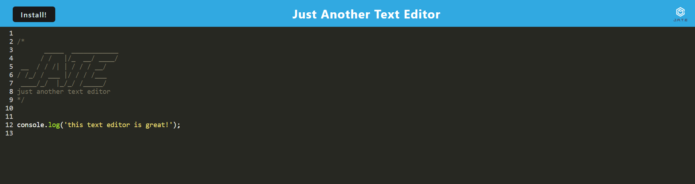

# Text_Editor

Text editor built as a PWA

## Descritpion

Text editor with local installation option.

## Usage

Web-based text editor that stores text typed into the editor.

Application can be installed to your machine for use offline.

Site Link:  
https://textedit-pwa-661050ebea6a.herokuapp.com/  

GitHub Repository:  
https://github.com/creechj/Text_Editor  

## Credits

npm webpack:  
https://www.npmjs.com/package/webpack  

npm webpack manifest:  
https://www.npmjs.com/package/webpack-pwa-manifest  

## License

Please see license in repository for this application